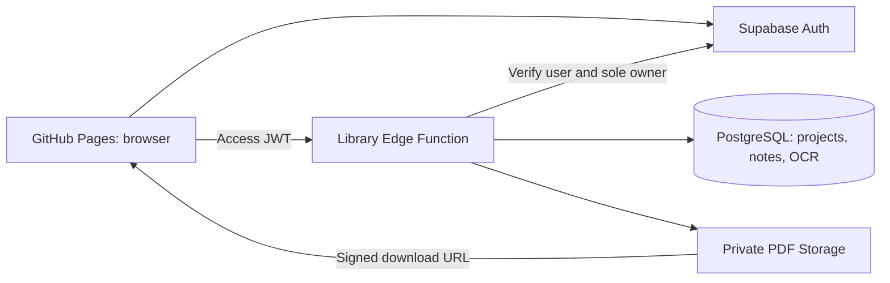

# Margin

A private PDF reading and notes library, built for Traditional Chinese textbooks and notes in Chinese, Vietnamese, and English.

**Site:** https://baole106.github.io/pdf-note/

## Features

- Import each PDF as a project; reopen its saved page and zoom.
- Select text to open **Copy · Note · Close**. Saving a note persists its highlight and selected passage.
- Add standalone notes, edit passages and notes, choose highlight colors, search, and export UTF-8 Markdown.
- Responsive reader and notes drawer for mobile browsers.
- PDF.js character maps and fonts for CJK PDFs.
- Optional on-device OCR for scanned pages: Traditional Chinese, vertical Traditional Chinese, Vietnamese, and English. Recognized word positions persist with the project. OCR can make mistakes; passages remain editable.
- Supabase password login, access tokens, automatic refresh-token rotation, and logout. No registration; one owner account.

## Stack

The frontend is plain HTML, CSS, and JavaScript in `web/`. Dependencies use pinned CDN URLs: PDF.js 4.10.38, Supabase JS 2.57.4, and lazily loaded Tesseract.js 6.0.1. There is **no npm install, frontend framework, or build step**. Google Fonts is optional; system fonts provide fallbacks.

GitHub Actions publishes only `web/` to GitHub Pages. Supabase provides Auth, PostgreSQL, private Storage, and one TypeScript/Deno Edge Function (`library`). Browser data operations go through the Edge Function; authentication uses the official Auth client, and PDFs download through short-lived signed Storage URLs.



## Security

- Passwords and service credentials never belong in frontend files or Git.
- `web/config.js` contains only the public project URL, public anon key, and internal email alias for the username.
- Public registration is disabled in the hosted Auth configuration. The login form maps `BaoLe106` to its internal Auth email alias.
- The API verifies every JWT with `auth.getUser()` and checks the sole account in `app_owner`.
- Every document operation checks ownership. Notes and OCR are scoped to an owned document.
- All application tables enable RLS and revoke direct `anon` / `authenticated` access. No client Storage policies exist; the PDF bucket is private.
- Function gateway `verify_jwt = false` is intentional: validation occurs inside the handler and supports Supabase's current signing keys. It does **not** allow unauthenticated data access.
- CORS permits the deployed Pages origin and local development origins. Saved user text is rendered using `textContent`.

## Free plan and limits

The deployed Supabase organization uses Free, and GitHub Pages serves the public source repository. The PDFs and notes remain private. No paid services or OCR APIs are used.

- Application upload limit: **40 MiB per PDF**.
- Library PDF cap: **950 MiB**, enforced transactionally by PostgreSQL, below the 1 GB Storage allocation.
- Notes: 20,000 characters per passage and 50,000 per note; OCR: 10,000 words per page.
- Supabase Free includes a 500 MB database and 1 GB Storage; bandwidth and function quotas also apply. Free projects can pause after inactivity, requiring restoration from the dashboard. Check [current Supabase plan limits](https://supabase.com/pricing).
- OCR accuracy depends on scan quality, typeface, and layout. Vertical writing and mixed columns can have imperfect reading order. OCR runs one page at a time to limit mobile memory usage.
- Encrypted PDFs must have their password removed before import. Internet access is needed for authentication, saving, downloads, and CDN dependencies. This version is not an offline app.

## Local development

```sh
python -m http.server 8000 --directory web
```

Open http://localhost:8000. Public connection settings are already in `web/config.js`. The frontend can use the hosted backend; sign in with the owner credentials.

Backend source:

```text
supabase/migrations/202609150001_library.sql
supabase/functions/library/index.ts
supabase/config.toml
```

Deploy an updated function with an authenticated Supabase CLI:

```sh
supabase functions deploy library --project-ref etyubwsyrfzteckfmhtt --use-api
```

The initial migration has already been applied. Do not rerun it on the existing database; add a new migration for schema changes. The deployed owner was provisioned through the Auth Admin API and inserted into `app_owner`. The account password is intentionally absent from this repository.

## Verification

Development-only browser checks require Python packages; they do not affect frontend hosting:

```sh
python -m pip install playwright pymupdf
python -m playwright install chromium
# Set PDF_NOTE_PASSWORD in your terminal environment, then:
python tests/browser_smoke.py
```

Set `PDF_NOTE_TEST_OCR=1` to include a real on-device OCR check; optionally set `PDF_NOTE_TEST_URL` to test the deployed site. The suite creates a multilingual test PDF, exercises the live API, then deletes its test project. Screenshots go to ignored `test-results/`.

The checks cover login, PDF upload/rendering, Chinese selection, the selection popover, Unicode notes, saved highlights/page/zoom, editing, Markdown export, mobile layouts, token refresh, deletion, and logout. Browser emulation checks narrow viewports; it does not replace testing on a physical iPhone.

## References

- [PDF.js examples and character maps](https://mozilla.github.io/pdf.js/examples/)
- [Tesseract.js API](https://github.com/naptha/tesseract.js/blob/master/docs/api.md)
- [Supabase Edge Function authentication](https://supabase.com/docs/guides/functions/auth)
- [Supabase Storage file limits](https://supabase.com/docs/guides/storage/uploads/file-limits)
